# Awaken —— 为真实企业业务而生的本地桌面智能体

> 不止回答问题，更能在本机把工作做完。

## 下载与平台支持

Awaken 支持 macOS 与 Windows 双平台。由于 Apple Developer Program 的申请仍在与 Apple 沟通处理中，macOS 版本暂未完成 Developer ID 签名与 Apple 公证，首次打开时需要按照下方教程手动允许。完成开发者认证后，将替换为正常签名、公证的 macOS 安装包。

当前安装包：

- [macOS（Apple Silicon／M 系列）](https://github.com/NolanGrant556/Awaken-Releases/releases/download/v0.0.0/Awaken-0.0.0-arm64.dmg)
- [macOS（Intel）](https://github.com/NolanGrant556/Awaken-Releases/releases/download/v0.0.0/Awaken-0.0.0-x64.dmg)
- [Windows](https://github.com/NolanGrant556/Awaken-Releases/releases/download/v0.0.0/Awaken.Setup.0.0.0.exe)

### macOS 安装与首次打开教程

1. 下载并打开与电脑架构对应的 Awaken `.dmg` 安装包。
2. 将 Awaken 拖入“应用程序”文件夹。
3. 打开“应用程序”，右键点击 Awaken，选择“打开”。
4. 如果系统仍然阻止运行，请进入“系统设置 → 隐私与安全性”。
5. 在安全提示中找到 Awaken，点击“仍要打开”。
6. 再次确认打开，即可正常启动 Awaken。

> 请勿全局关闭 macOS 的 Gatekeeper 安全保护。以上操作只允许打开本次下载的 Awaken 应用。

文件 SHA-256 校验值

- macOS Apple Silicon：`0d9481d13a0c996795f67c77ebf2427cb3f4b849378579f9453115a7e2223124`
- macOS Intel：`e138a8f6ae60f1d45d111ba61e403ab6f2f28a238870332432e080ade61722c4`
- Windows：`553ee68f985e321261cd9d8cfdb85d26d06826da45ab2bc8cf2c3df79f420ba0`

## 产品简介

### 把任务交给 Awaken，自主执行，唤醒自由

Awaken 是一款基于传统企业真实业务场景针对性开发的本地优先桌面智能体。它不是只提供建议的通用聊天助手，而是从财务、人力资源、采购、销售、市场、运营、行政法务等部门每天真实发生的工作出发，让 AI Agent 直接进入用户的本地工作环境，自主读取和处理 Excel、PDF、PPT、Word 等业务材料。

用户只需交代任务，Awaken 便能自主完成“理解材料 → 提取信息 → 分析判断 → 结构化整理 → 生成正式交付物”的完整工作链路，将原本需要反复打开文件、复制数据和整理格式的工作，转化为可追踪、可复核、可直接使用的成果。

**真正的亮点，不只是 AI 能回答问题，而是它能在真实业务场景中把工作做完。**

### 是什么？

Awaken 是一款本地优先的桌面智能体应用：用户在自己电脑上和一个具备真实 Shell、真实文件系统、真实办公软件调用能力的 AI Agent 对话，让它直接在本机完成多轮、可追溯的实际工作，而不是一个只会聊天建议、或者活在云端沙盒里“假装干活”的助手。它能解决每个部门格式各异的原始材料（Excel/PDF/PPT/Word），把“提取信息 → 结构化整理 → 生成正式交付物”这条链路自动跑完。同一套 Agent 能力，在不同部门文件夹里长出完全不同的垂直场景。

### 面向谁？

#### 部门的垂直场景举例

- **财务部：** 月末上百张报销发票 PDF 混在一个文件夹里，Agent 逐张提取金额/日期/事由，对照报销标准和历史记录，自动标出超标准、疑似重复报销的单据，生成一份“异常清单+汇总台账”，财务只需要复核异常项，不用把每张单据都翻一遍。
- **人力资源部：** 一个岗位收到 100+ 份简历 PDF，Agent 逐份解析学历/年限/技能匹配度，生成一份结构化候选人对比表并按匹配度排序，HR 只看排名前 10，不用一份份打开简历。
- **业务运营部：** 总部汇总的全国门店销售/库存 Excel，Agent 按区域拆分出“谁涨谁跌、哪些门店库存告警”，生成分区域简报，发送前弹出确认框列出全部目标群和文案，一次性发到 30+ 个区域钉钉/飞书群。
- **市场部：** 一场活动结束后，各投放渠道各自导出的效果 Excel/PDF 散落一堆，Agent 汇总成一份带 ROI 对比、渠道排名的复盘 PPT，省去人工对齐口径、逐个渠道拷数字做图表的过程。
- **销售部：** 产品价目表 + 客户折扣规则 + 一份意向客户名单，一句话生成 20 份定制化报价 PDF（每份价格、条款按客户单独计算），销售不用一个个复制模板改数字。
- **采购部：** 5 家供应商各自格式不同的报价 PDF，Agent 提取每家的价格/交期/规格，生成统一格式的比价表，并标出明显偏离历史均价的异常报价提醒核实——采购比价这件“格式对不齐”的苦活儿被直接接管。
- **客户服务部：** 本月客诉记录导出表，Agent 按问题类型自动分类，生成“高频问题+改进建议”周报；对需要回访的客户，先生成回访消息清单，发送前照样有确认框，不会自己联系客户。
- **行政与法务部：** 批量扫描本月新签合同 PDF，提取金额/期限/付款节点/违约条款，生成合同台账，并标出即将到期需要续签的合同，通知对应负责人确认——合同关键信息全靠人工翻页摘抄的活儿被接管。
- **经营管理部：** 到了月末，把上面 8 个部门这个月各自更新的材料汇总成一份经营分析 PPT 初稿，并标注哪些部门数据还没交，这是这些部门场景的“上层视角”，不是取代它们。

### 主要功能

#### 产品主界面

三栏桌面工作台：左侧项目/线程，中间 Workbench（任务输入、Agent 执行叙事、终态与交付物），右侧开发中，下一版本将上线。

  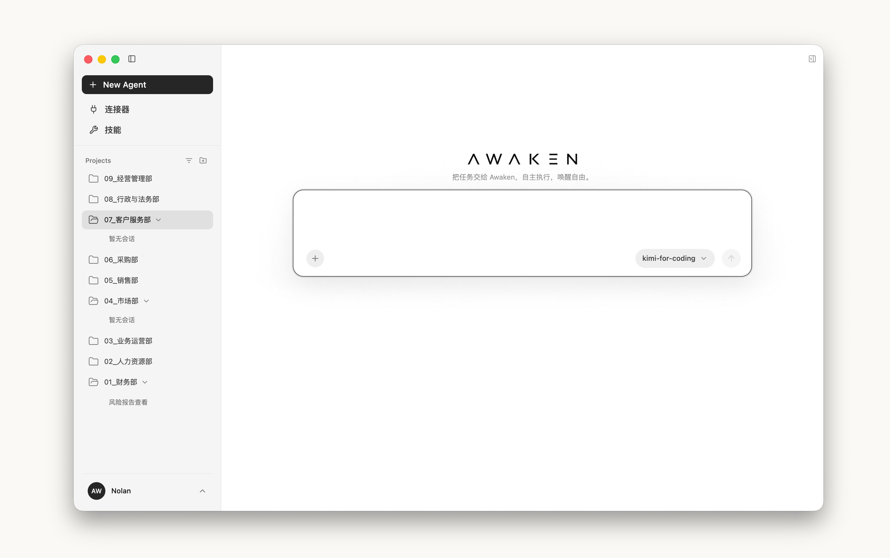
  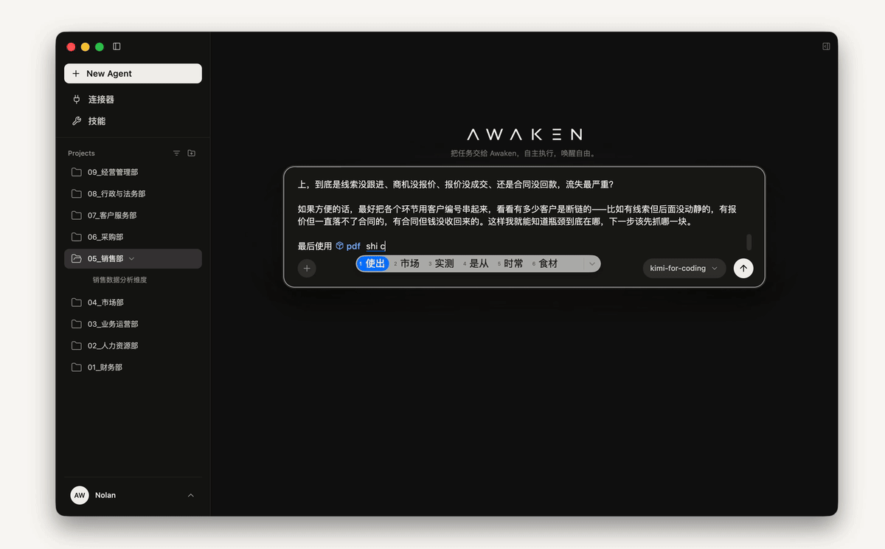

#### 桌宠界面

Settings 选择宠物后，可唤醒独立透明浮窗；随 Agent 运行状态切换动画，并提供 running / waiting / failed 等通知气泡，点击可回到对应 thread，运行中可 Stop。

  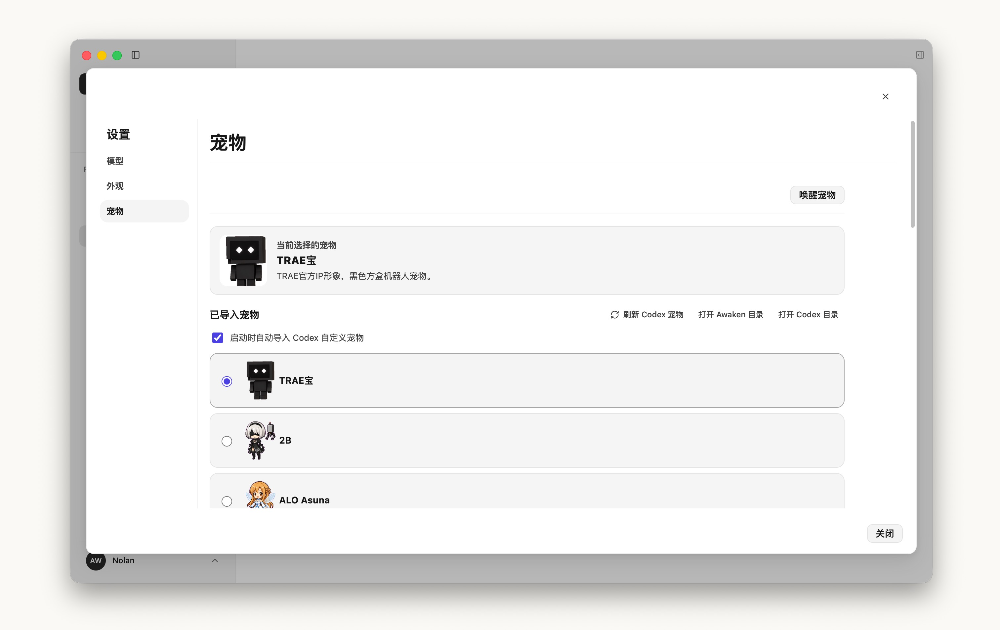
  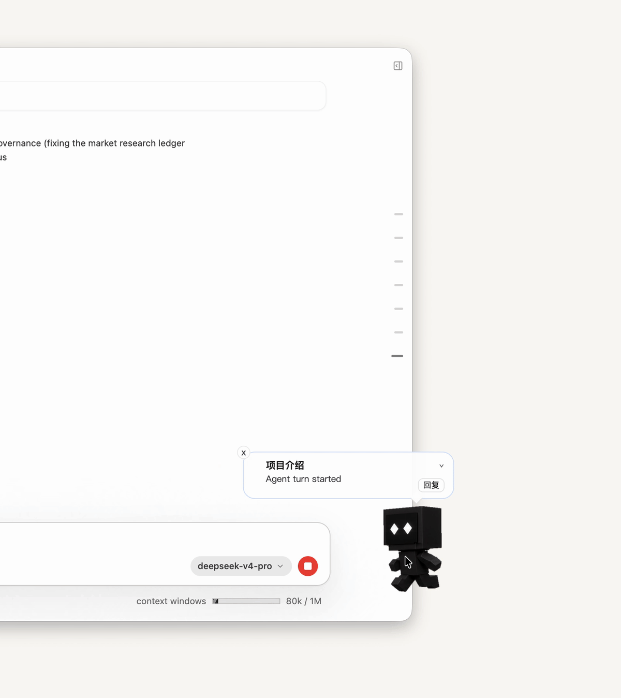

#### Agent 提问

当 Agent 执行中缺少会显著影响结果的关键选择时，会暂停并向用户提问，获取更仔细的信息。

  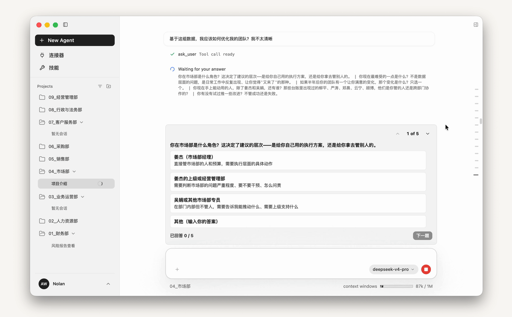

#### 交付物卡片：Work 文档本地即时打开

Agent 执行任务结束后，交付物会以卡片形式出现在最终回答下方。点击即可在本机用系统默认应用打开（Word / Excel / PPT / PDF / Markdown 等）。

  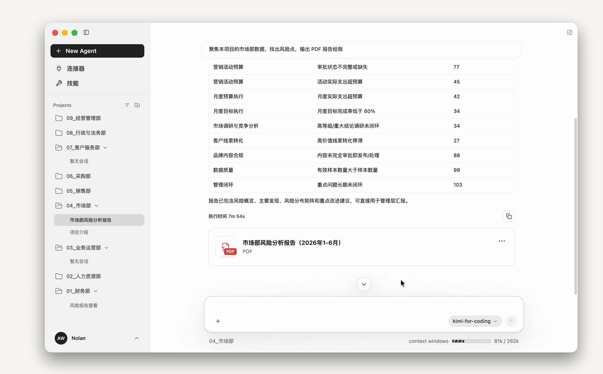

#### Skill 界面

在 Settings 管理项目 skills 和全局 skills，并且可以在输入框选择。

  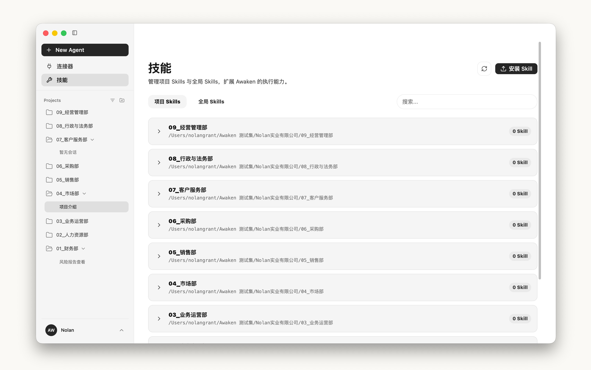
  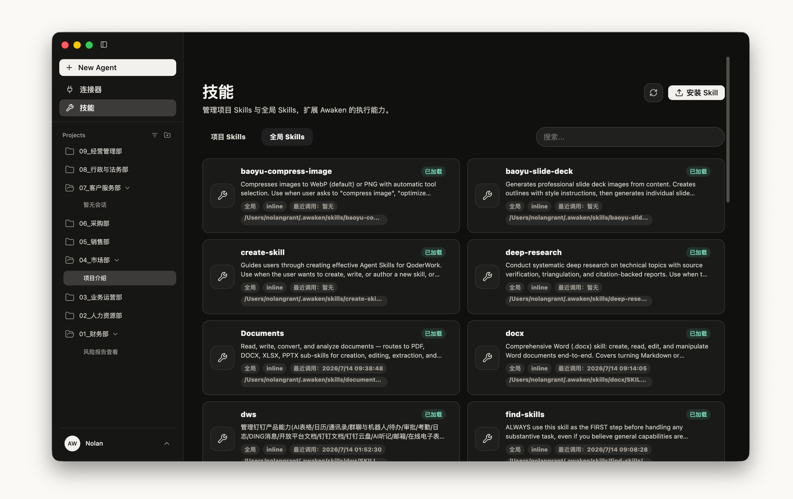
  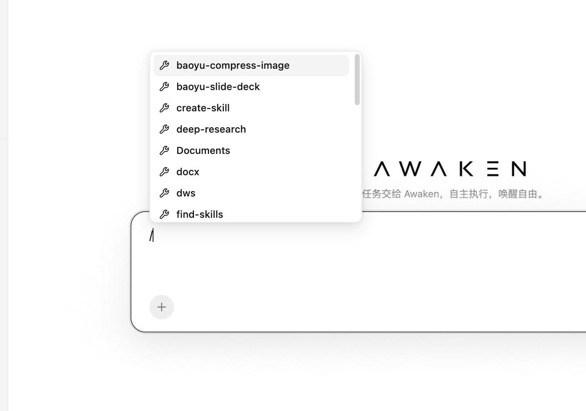

#### 连接器界面

在设置中管理 MCP、CLI 等连接器，用于扩展 Awaken 的对外工作能力。

  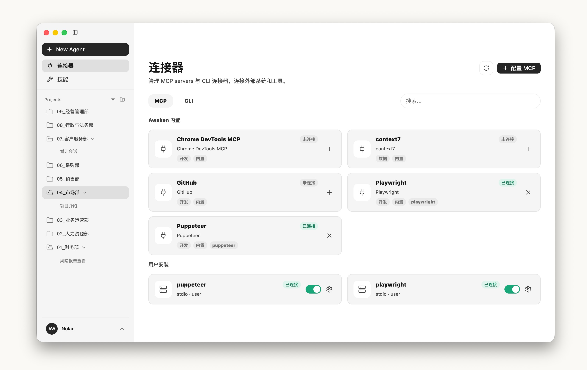
  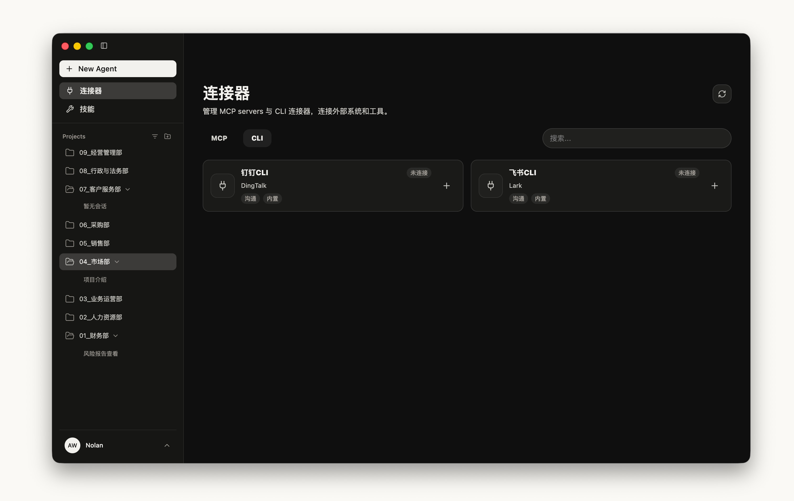

#### 模型界面

Settings > 模型：配置模型供应商、设置 LLM 上下文大小、输出长度。

  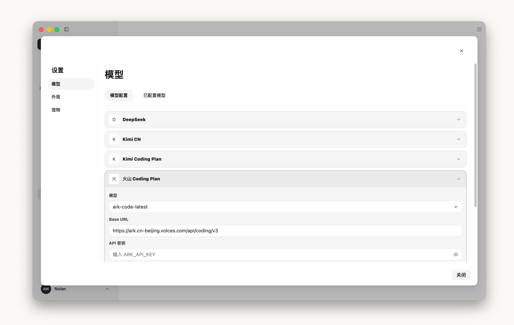
  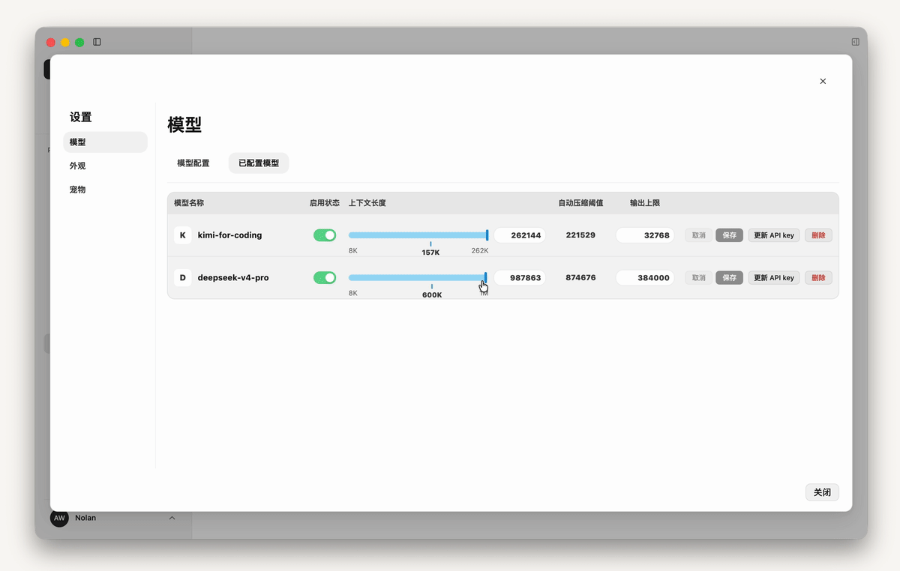

#### 模型额度界面

Workbench 提供余额/额度入口。点击后向对应供应商接口实时查询并展示。

  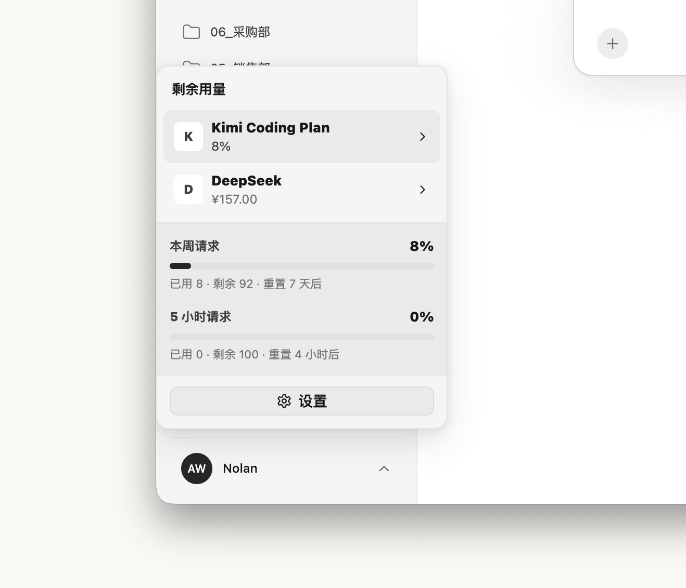

