# Awaken —— 为真实工作而生的本地桌面 Agent

> 不止回答问题，更能在本机把工作做完。

## 下载与平台支持

Awaken 支持 **macOS** 与 **Windows**。

- **Windows：** [下载 Awaken Setup 0.0.0](https://github.com/NolanGrant556/Awaken-Releases/releases/download/v0.0.0/Awaken.Setup.0.0.0.exe)
- **macOS（Apple Silicon）：** [下载 Awaken 0.0.0 arm64](https://github.com/NolanGrant556/Awaken-Releases/releases/download/v0.0.0/Awaken-0.0.0-arm64.dmg)
- **macOS（Intel）：** [下载 Awaken 0.0.0 x64](https://github.com/NolanGrant556/Awaken-Releases/releases/download/v0.0.0/Awaken-0.0.0-x64.dmg)

### macOS 首次安装

> [!IMPORTANT]
> 首次打开 Awaken 时，macOS 可能提示“Awaken.app 已损坏，无法打开”，并建议将它移到废纸篓。文件本身并未损坏；这是因为当前下载包尚未完成 Apple 公证，系统无法验证其 Apple 签名与公证状态。请不要点击“移到废纸篓”，按照下方任一方法完成安装后即可正常使用。

Awaken 的正式 macOS 安装包已经完成 Developer ID Application 签名、Hardened Runtime 和 entitlements 配置，并已提交 Apple Notary Service。目前正在等待 Apple 完成公证处理；公证结果返回并更新下载包后，将不再需要下方的手动允许步骤。请只从本页面下载安装包。

先打开 DMG，将 `Awaken.app` 拖入“应用程序（Applications）”文件夹，再尝试打开一次。

#### 方法一：在“隐私与安全”中允许（推荐）

1. 打开“系统设置 → 隐私与安全”。
2. 向下滚动到“安全性”，找到 Awaken 被阻止的提示。
3. 点击“仍要打开（Open Anyway）”，使用登录密码或 Touch ID 确认，再点击“打开”。

“仍要打开”按钮通常只会在尝试打开 Awaken 后的一段时间内出现。成功允许一次后，后续可以正常双击打开。

详细说明可参考 [Apple 官方的“打开来自身份不明开发者的 App”指南](https://support.apple.com/guide/mac-help/mh40616/mac)。

#### 方法二：使用终端命令

确认 `Awaken.app` 已放入“应用程序”文件夹后，打开“终端”，执行：

```bash
sudo xattr -cr /Applications/Awaken.app
```

输入 Mac 登录密码后按回车（终端不会显示输入的密码），再重新打开 Awaken。该命令只清除 `Awaken.app` 自身的扩展属性（包括下载隔离与来源标记），不会全局关闭 macOS Gatekeeper；请勿对来源不明的应用执行。

如果看到“Awaken.app 已损坏”的提示，请点击“取消”，不要将 Awaken 移到废纸篓，然后使用上述任一方法继续安装。

### macOS SHA-256

```text
bd5374329b6930a7e3c229c82e3acb43a1736ab2b689104a7c41d99398c6a697  Awaken-0.0.0-arm64.dmg
6ef7e4fe99e19e7914df3cf4debaf188b2248064e1fc3110fd3eefa1ef53902c  Awaken-0.0.0-x64.dmg
```

## 使用前配置

Awaken 的模型能力由用户按需接入。首次使用前，请先在「设置 → 模型」中配置至少一个可用的大语言模型供应商并添加模型；发起任务时，可以在当前会话中选择模型并调整推理强度。

<p align="center">
  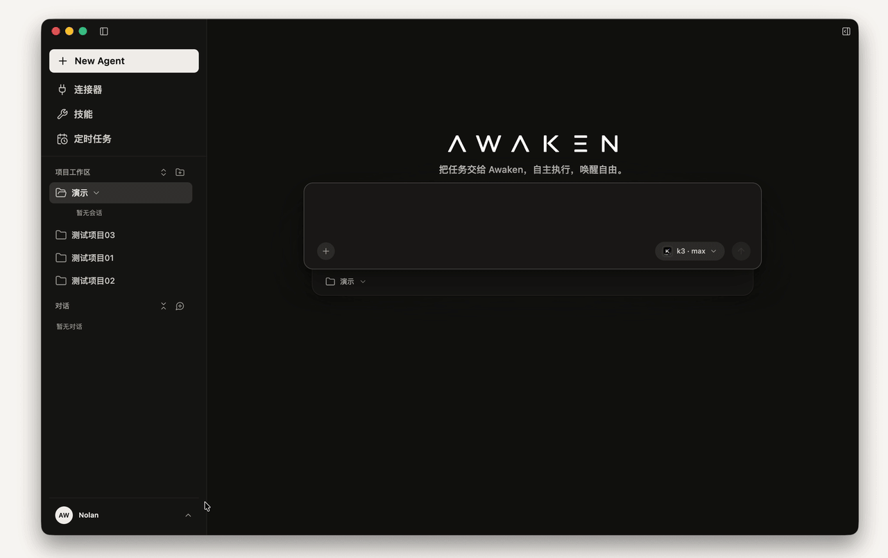
</p>

如需使用图片或视频生成功能，请在 Agent Plan 中单独配置对应供应商与模型。配置完成后，这些能力将作为独立工具，由主 Agent 根据任务目标按需调用。

<p align="center">
  
</p>

## 产品简介

### 是什么？

Awaken 是一个本地运行的桌面 Agent。用户既可以直接发起对话，也可以选择项目文件夹，将不同业务划分为独立的工作场景。应用、工作空间、文件操作和交付物都组织在用户电脑上；LLM、搜索、生图、视频等能力则由用户按需配置接入。

不同于套用现成的 Agent 框架，Awaken 以我们自研的 **Agent Core** 与 **Tool Runtime** 为底座。从上下文构建、模型调用、任务推进，到工具注册、执行反馈和失败恢复，核心执行链均由自身实现并统一管理。每次模型请求的 Token 用量、缓存命中、调用延迟与成本都会留痕，便于围绕真实任务效果持续调优模型、推理强度和缓存策略。

Awaken 要解决的核心问题，是让 AI 不只给出建议，而是能够理解真实资料、调用 Skills 与工具、持续推进任务，最终形成可检查、可继续修改的工作成果。

### 面向谁？

Awaken 主要面向企业中的经营管理、财务、采购、销售、市场、运营、行政与法务等 Work 场景。它适合的不是简单的“一问一答”，而是需要 Agent 在多个文件、系统、多项判断和多种工具之间持续推进，并完成一项真实工作的场景。

## 核心演示场景

### 场景一：企业经营风险分析

以模拟数据集「Nolan 实业有限公司」为基础，进入对应项目后，选择适合复杂分析的 LLM 和推理强度。

主 Agent 读取企业公共资料及财务、销售、采购、运营、市场、法务等部门文件，并调度多个 Subagent，分别完成数据核对、经营异常分析、风险检查和改进机会评审。各 Subagent 返回结果后，由主 Agent 汇总跨部门关联问题，形成企业经营风险分析报告、管理层汇报 PPT 和风险跟踪表。

这个场景重点展示 Awaken 如何组织模型、Skills、工具和 Subagent，共同完成一次复杂的企业经营分析任务。

#### 第一步：创建项目并选择业务资料文件夹

<p align="center">
  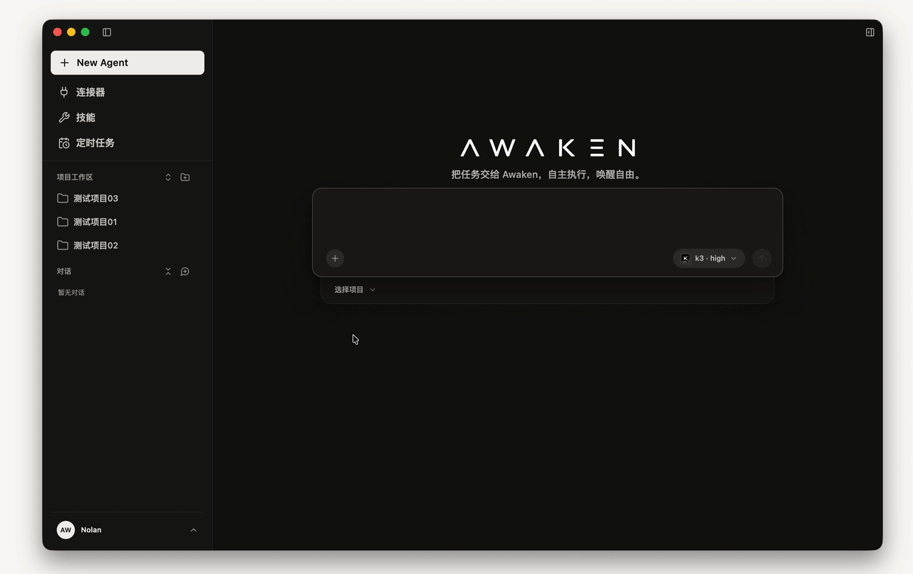
</p>

#### 第二步：按需启用全局 Skills、项目 Skills、内置 Skills 与 Agents Skills

<p align="center">
  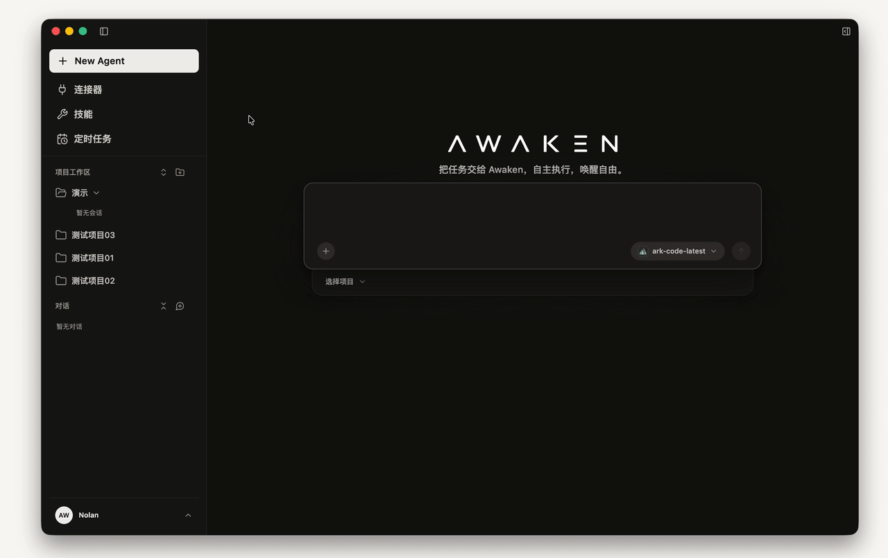
</p>

#### 第三步：发起任务

<p align="center">
  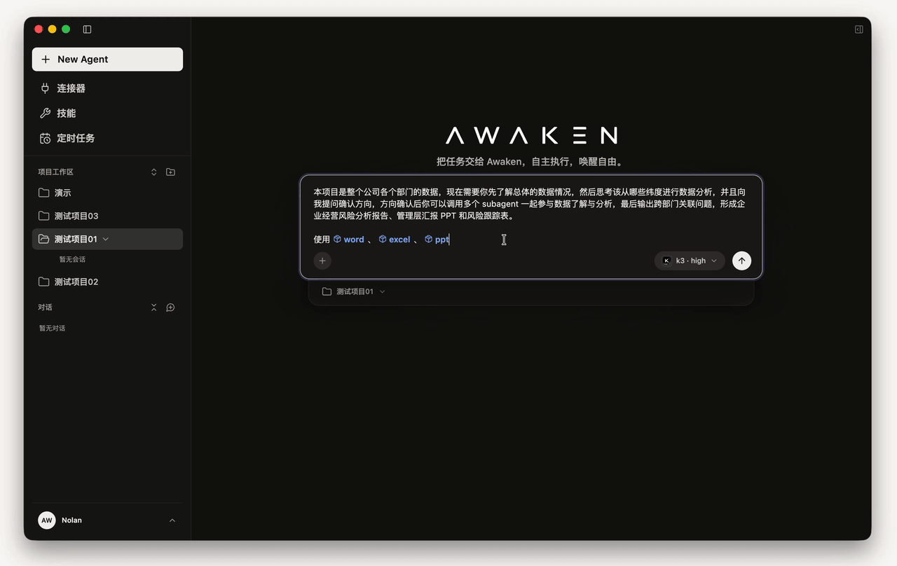
</p>

#### 第四步：Agent 主动提问，用户继续补充要求

<p align="center">
  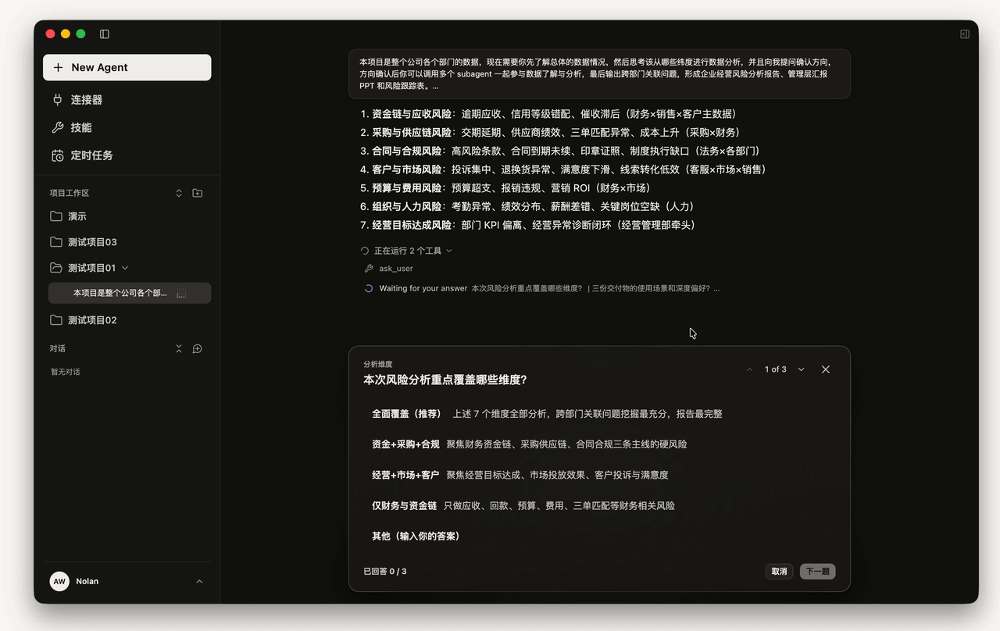
</p>

#### 第五步：主 Agent 调度多个 Subagent 协同分析

<p align="center">
  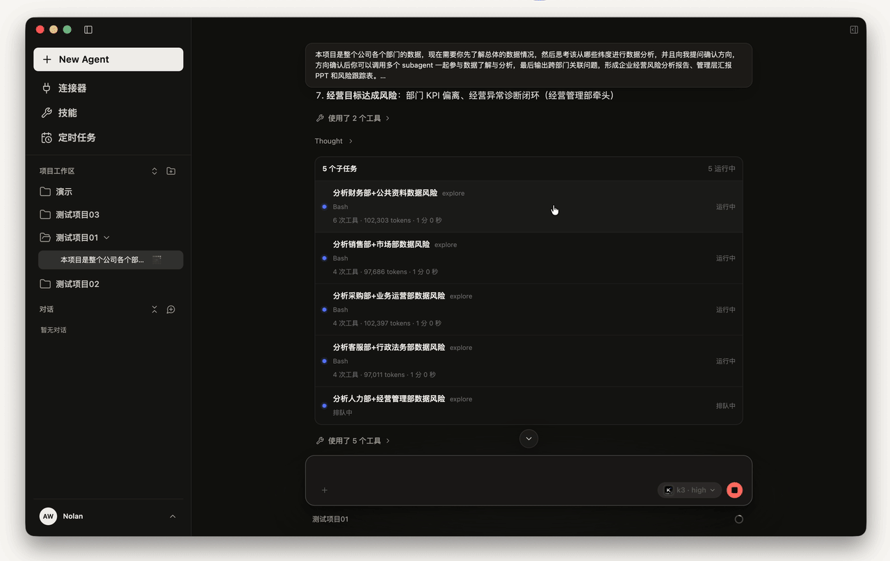
</p>

#### 第六步：交付并查看 Word、Excel 与 PPT 成果

<p align="center">
  
</p>

### 场景二：服装制造业多模态应用

主 Agent 理解客户 TP 资料后，调用图片生成工具输出服装款式模特图；用户选定合适的图片后，Agent 再将其作为视觉素材，调用视频生成工具输出产品展示短片。

这个场景体现的不是两个孤立的生图、视频按钮，而是同一个桌面 Agent 根据任务目标，自主判断并调用不同模态工具，完成一条连续工作链。

#### 第一步：从右侧文件栏浏览文件并添加到输入框

<p align="center">
  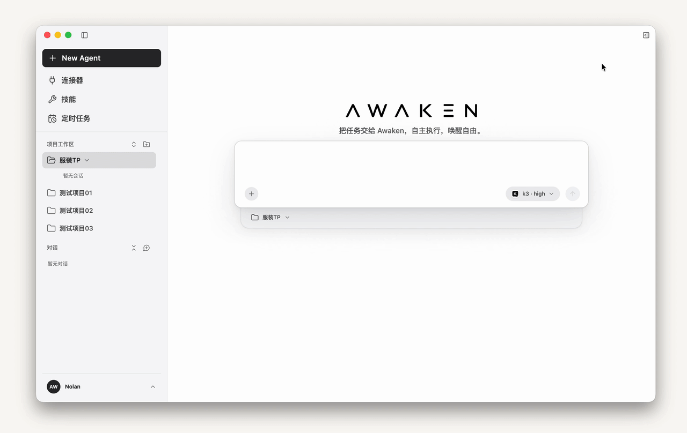
</p>

#### 第二步：主 Agent 理解客户 TP 并生成多张图片

<p align="center">
  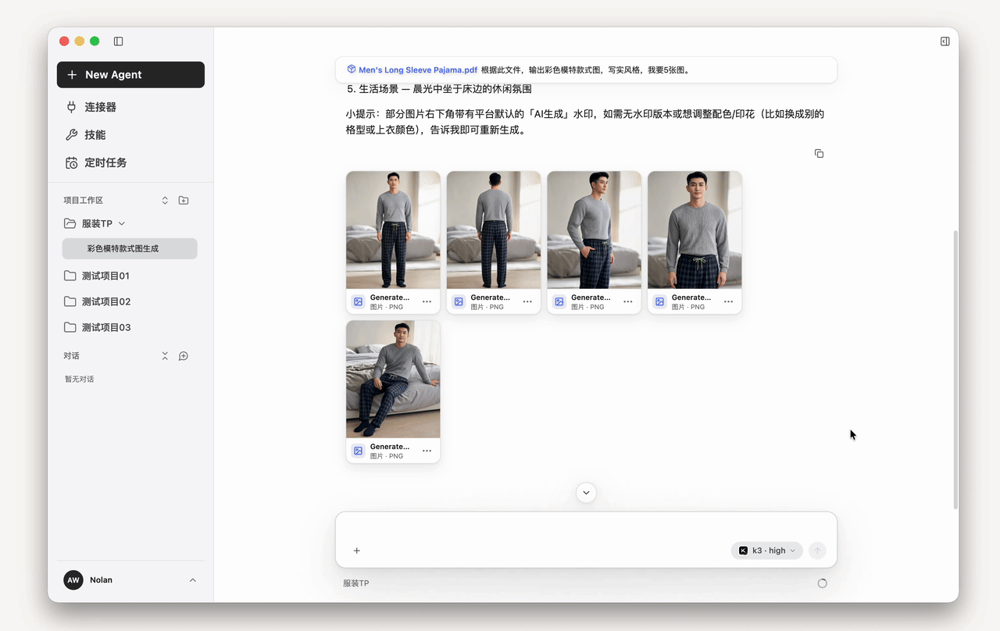
</p>

#### 第三步：用户确认后继续生成视频

<p align="center">
  
</p>

## 其他功能

除上述两个核心场景体现的能力外，Awaken 还具备以下功能。

### Computer Use

Agent 可以识别并操作电脑界面，通过点击、输入、滚动和快捷键等方式完成桌面任务。

<p align="center">
  
</p>

### 记忆功能

支持跨会话记忆，以及通过 Dream 对记忆进行自动整理和维护。

<p align="center">
  
</p>

### 定时任务

支持创建、编辑、启停、立即执行和取消周期性或指定时间任务。

<p align="center">
  
</p>

### ACP 智能体协作

支持接入和调度外部智能体，扩展 Awaken 的协作边界。

<p align="center">
  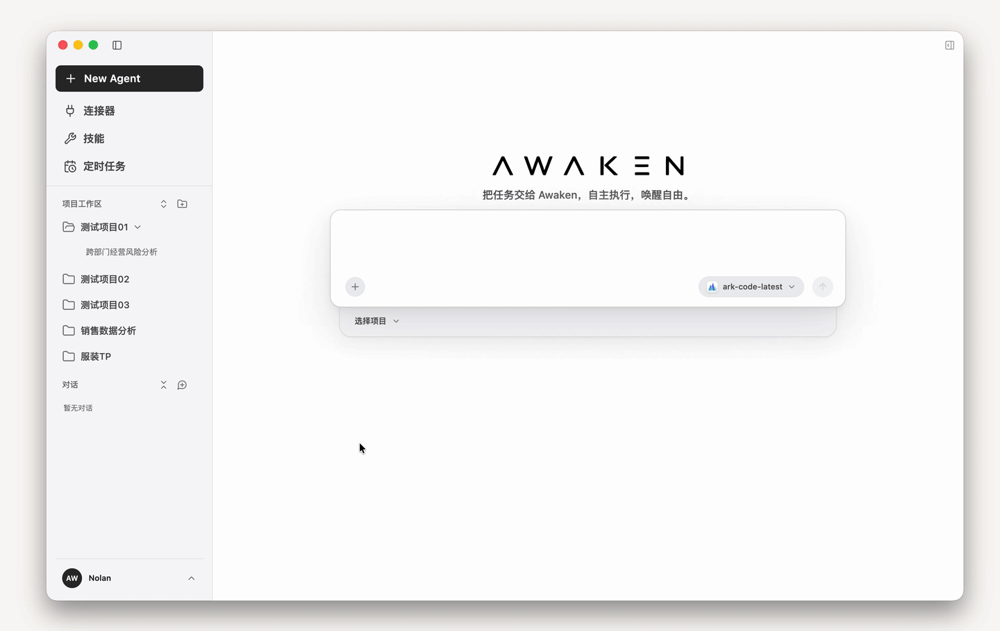
</p>

### 上下文看板

可以查看当前上下文使用情况与缓存命中情况。

<p align="center">
  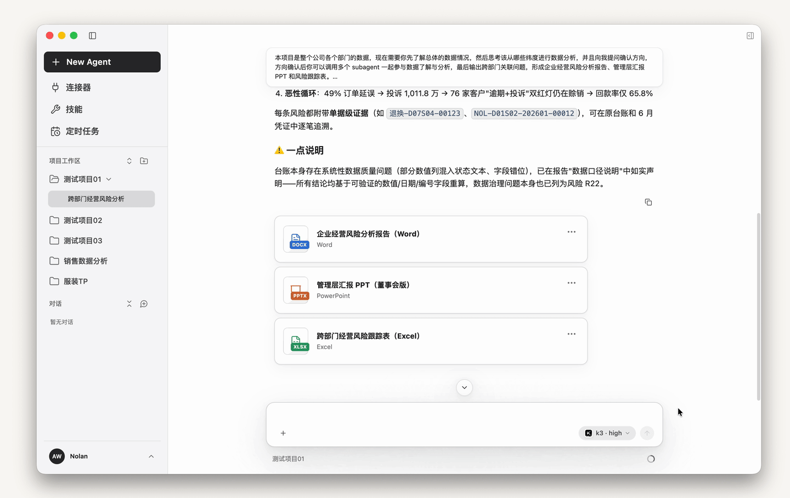
</p>

### 连接器

支持配置 MCP 与 CLI 连接器，扩展 Agent 可以调用的外部系统和工具。

<p align="center">
  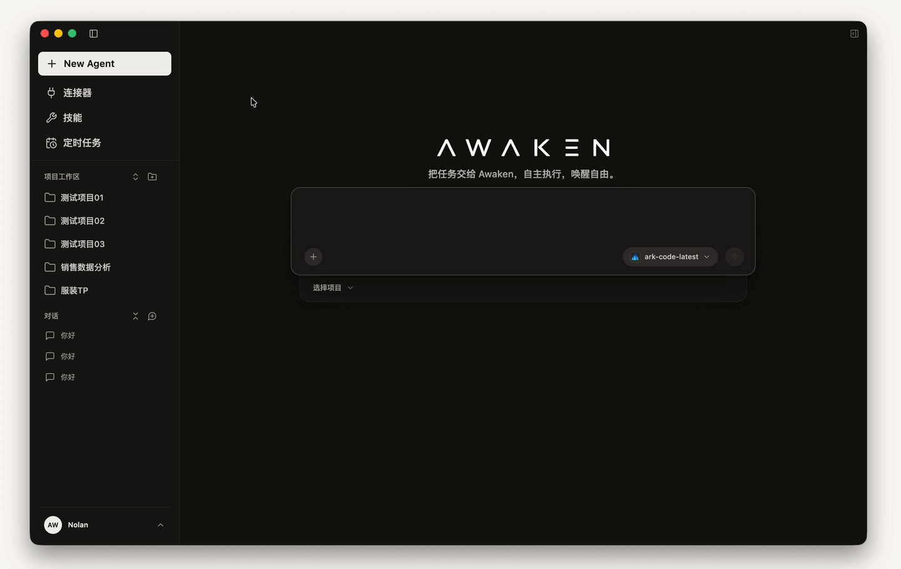
</p>

### 桌面宠物

通过独立桌面浮窗展示 Agent 的运行、等待、完成和失败状态，并可快速返回对应任务。

<p align="center">
  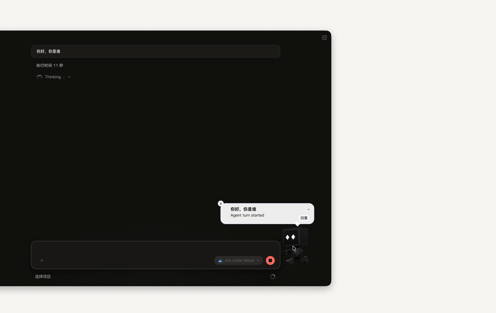
</p>

### Web 搜索

Agent 可以调用网络搜索工具，获取、筛选和整理外部信息。

### API 用量查询

可以实时查询用户所配置服务的 API 或 Coding Plan 额度情况。

<p align="center">
  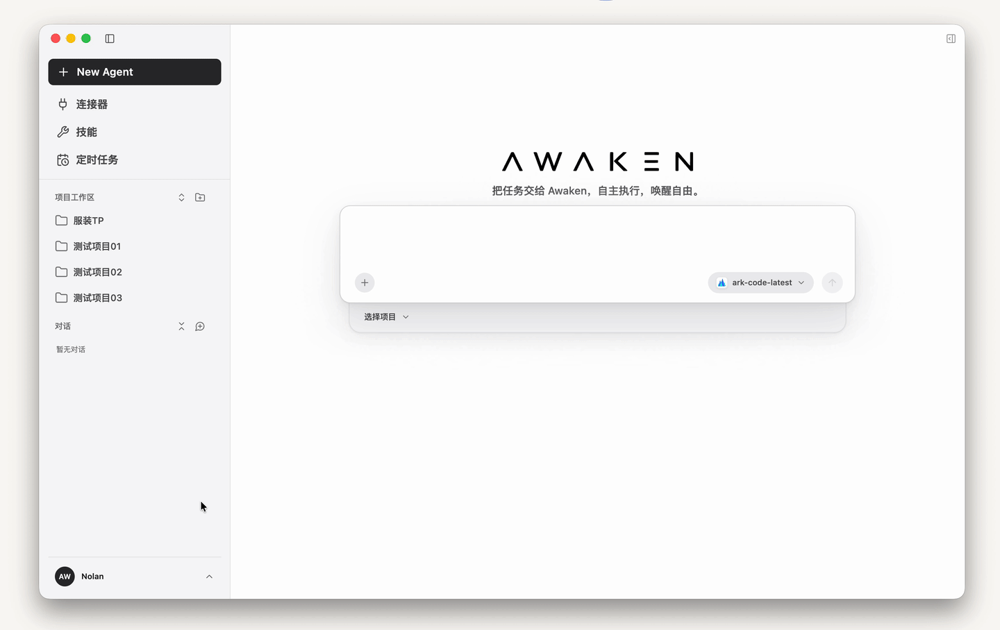
</p>
